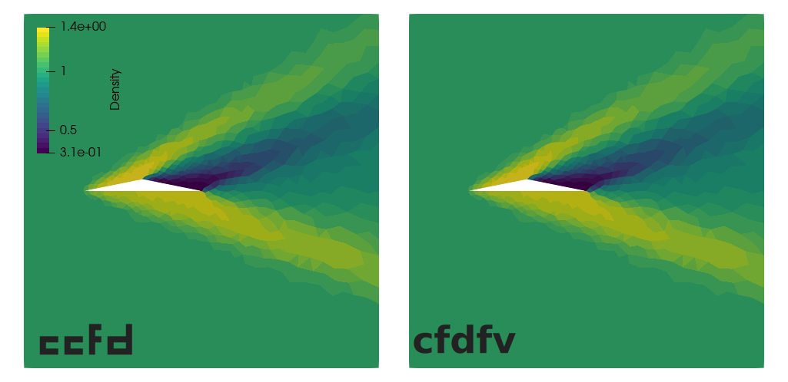

This code is intended to become a drop-in replacement for `cfdfv`, a CFD code written in Fortran by the [Institute of Aerodynamics and Gas Dynamics](https://www.iag.uni-stuttgart.de/en/) at the University of Stuttgart for a CFD programming course. This code itself is not available online, as far as I know, but it is a modified version of [FLEXI](https://www.flexi-project.org/).

The program uses the [CGNS](https://cgns.github.io/) library version 4.1.1, for storing the calculation results.

The logo is heavily inspired by the software over at [suckless.org](https://suckless.org/).



# Dependencies

- `git`
- `make`
- `gcc`
- `gnuplot` (optional, for displaying calculation residuals, available [here](http://www.gnuplot.info/))
- `gmsh` (optional, for mesh generation, available [here](http://gmsh.info/))
- `paraview` (optional, for post-processing the results, available [here](https://www.paraview.org/))

# Installation

The installation process is easiest on Linux, but possible on MacOS and Windows. For best performance you should build an run it on your native OS.

## Linux

First make sure that all necessary dependencies are all installed. These can usually be obtained through your distributions package manager, on Arch based systems the following command should suffice
```
# pacman -S git base-devel
```
For an Ubuntu like system the following command should do the trick
```
# apt-get install git build-essential
```

Next, navigate to the directory where you want to keep `ccfd` files and clone the git repository
```
$ cd path/to/directory
$ git clone https://github.com/hhh95/ccfd.git
```
Then, you can enter change to the `ccfd` directory and build the program using `make`
```
$ cd ccfd
$ make
```
This should compile the code and create the two folders `obj` and `bin`, the last one containing the `ccfd` executable.

## MacOS

It should work basically the same as with Linux, but detailed instructions will follow soon...

## Windows

It should work basically the same as with Linux, but detailed instructions will follow soon...

# Usage

Navigate to the `calc` folder. Here you will find example input files, such as the SOD test case. The calculation can be started by simply executing `ccfd` followed by the `.ini` file, containing the case setup
```
$ ../bin/ccfd sod.ini
```
The program will display information about the initialization and time stepping process until the calculation is finished. Depending on what output format was set in the `.ini` file, the results at the specified output times/intervals are written to disk.
